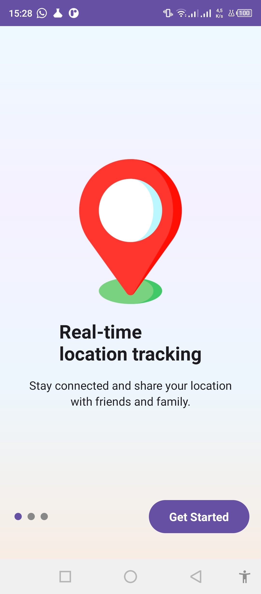
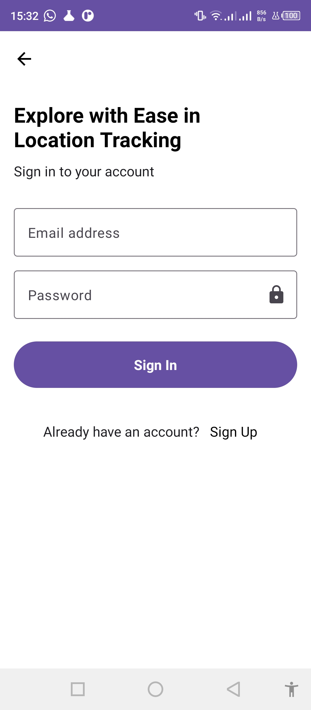
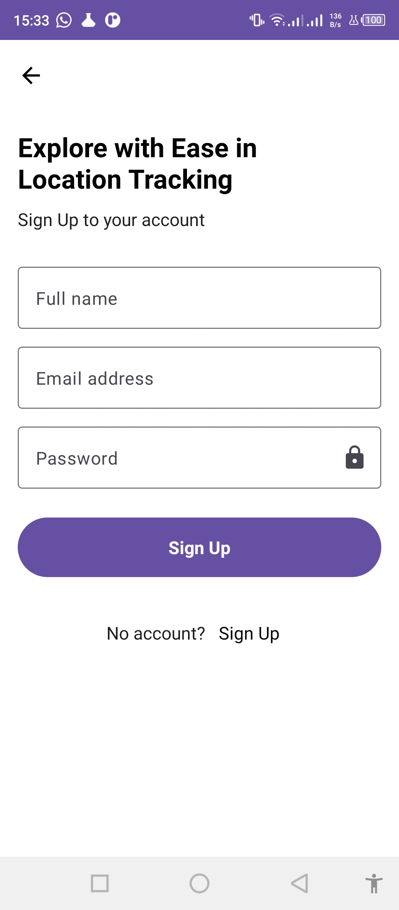
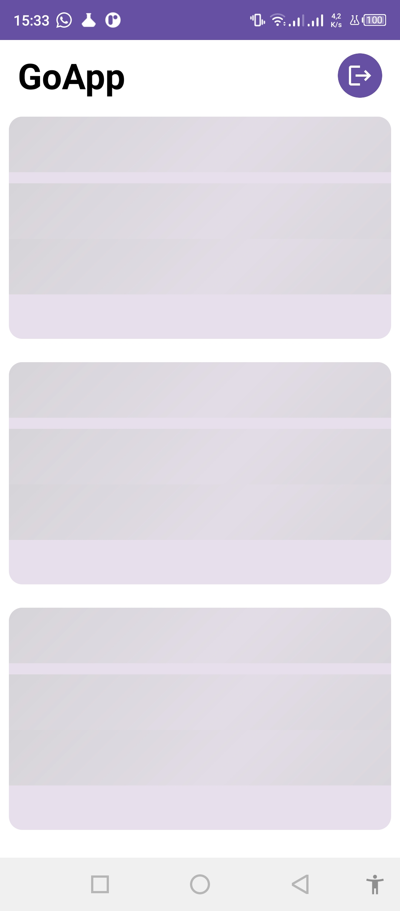
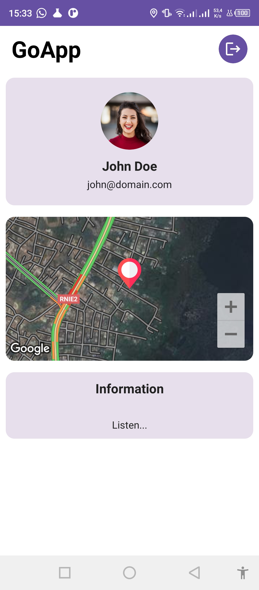

# GoApp

A simple android application built using jetpack compose , Hilt, MVVM.

### :scroll: Overview

1. Login
2. Registration 
3. State management for input field updates, button event update and navigation with the help of
   viewmodel
5. Maps
6. Webscoket

7. Turn on Gps

### :camera: Screenshots

#### Light

## Thank
